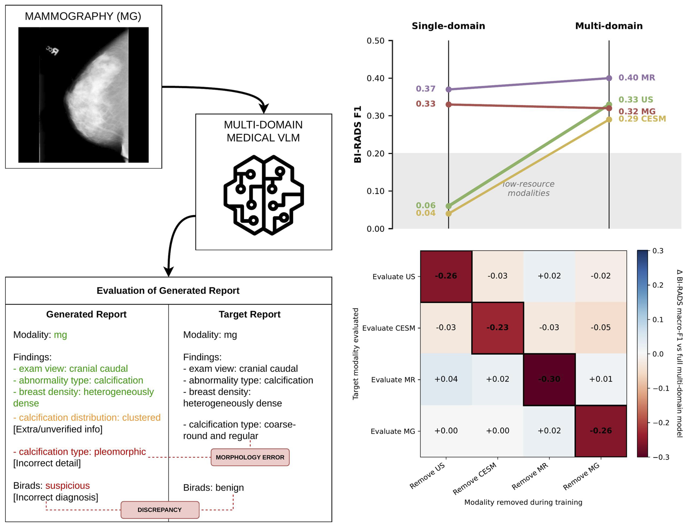
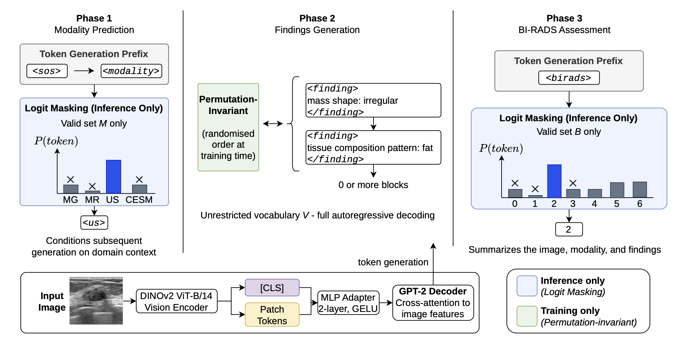
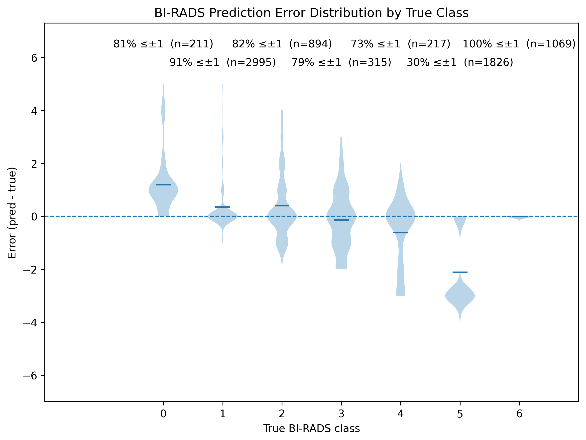

# MultiBreast: When Does Multi-Domain Transfer Help?

**BMVC 2026**

Structured breast imaging report generation across four modalities: mammography (MG), ultrasound (US), contrast-enhanced spectral mammography (CESM) and MRI (MR). We harmonise 12 public datasets into one exam-centric schema and train a DINOv2–GPT-2 model (244M params) that emits reports as ordered decisions: modality, findings, BI-RADS.



## Method



1. **Encode** — DINOv2 ViT-B/14 produces `[CLS]` + patch tokens.
2. **Project** — 2-layer GELU MLP maps visual features into GPT-2 embedding space.
3. **Generate** — GPT-2 decodes `<modality>` → zero or more `<finding>` blocks (`key: value`) → `<birads>`, with cross-attention to image tokens in every block.

Logit masking constrains modality and BI-RADS to their closed clinical vocabularies; findings stay open-vocabulary. Finding blocks are randomly permuted during training. Decoding is greedy, 256-token cap.

## Installation

```bash
pip install -r requirements.txt
```

## Repository Structure

```
MultiBreast/
├── data_preprocessing/
│   ├── dto/                        # Per-dataset adapters (one per source)
│   └── preprocessing_configs.py    # Raw data paths — edit this first
├── models/
│   ├── amber/                      # Main model (train.py, inference.py, raddinov2.py)
│   ├── amber_cls/                  # Linear BI-RADS classifier reference
│   └── amber_no_modality_text/     # No-modality-conditioning ablation
├── eval/                           # eval_single.py, eval_on_set.py (+ _cls variants)
├── configs/                        # train/, eval_single/, eval_on_set/ YAMLs
├── gradient_conflict_check.ipynb   # Per-modality gradient cosines
├── Makefile
└── requirements.txt
```

## Data

Datasets must be downloaded separately under their own licenses. This repo provides the harmonisation pipeline and schema, not the images.

| Modality | Datasets |
| --- | --- |
| US | [Breast-Lesions-USG](https://www.cancerimagingarchive.net/collection/breast-lesions-usg/), [OASBUD](https://zenodo.org/record/545928) |
| CESM | [CDD-CESM](https://www.cancerimagingarchive.net/collection/cdd-cesm/) |
| MR | [Advanced-MRI-Lesions](https://www.cancerimagingarchive.net/collection/advanced-mri-breast-lesions/), [MAMA-MIA](https://www.synapse.org/Synapse:syn60868042), [LA-Breast](https://data.mendeley.com/datasets/8rzyn3ng9c/1) |
| MG | [Breast-Micro-Calc](https://zenodo.org/records/7969411), [CMMD](https://www.cancerimagingarchive.net/collection/cmmd/), [EMBED](https://registry.opendata.aws/emory-breast-imaging-dataset-embed/), [CBIS-DDSM](https://www.cancerimagingarchive.net/collection/cbis-ddsm/), [RSNA-BCD](https://www.kaggle.com/competitions/rsna-breast-cancer-detection/data), [INBreast](https://doi.org/10.1016/j.acra.2011.09.014) |

Set paths in `data_preprocessing/preprocessing_configs.py`, then:

```bash
make process_and_split
```

This runs every adapter, builds the exam index, and emits patient-wise stratified splits plus the four leave-one-modality-out training sets. Labels are inherited from the sources. There is no relabelling.

| Modality | Train | Val | Test | BI-RADS classes |
| --- | --- | --- | --- | --- |
| US | 255 | 100 | 101 | 5 |
| CESM | 805 | 100 | 103 | 6 |
| MR | 220,609 | 2,774 | 3,269 | 6 |
| MG | 403,238 | 1,552 | 4,054 | 7 |

## Quick Start

```bash
# Multi-domain model (all four modalities)
python -m models.amber.train --yaml_config configs/train/amber/baseline.yaml --seed 1

# Single-domain baselines
python -m models.amber.train --yaml_config configs/train/amber/baseline_us.yaml --seed 1

# Hold-one-modality-out
python -m models.amber.train --yaml_config configs/train/amber/baseline_homo_no_mr.yaml --seed 1

# Ablation: no modality conditioning
python -m models.amber_no_modality_text.train --yaml_config configs/train/amber_no_modality_text/baseline.yaml

# Reference: linear BI-RADS classifier
python -m models.amber_cls.train --yaml_config configs/train/amber_cls/baseline.yaml
```

Swap `us` for `cesm`, `mr`, `mg` in the config names. Set `load_rad_dino=True` in `models/amber/amber.py` for the RAD-DINO encoder variant.

### Evaluation

```bash
# Per-modality metrics across seeds, 95% bootstrap CIs
python -m eval.eval_single --eval_single_config configs/eval_single/amber/baseline_on_us.yaml

# Confusion matrices, ordinal error, t-SNE, CKA (single seed)
python -m eval.eval_on_set --eval_on_set_config configs/eval_on_set/amber/baseline_on_all.yaml

# Qualitative inference
python -m models.amber.inference
```

Metrics: BI-RADS macro-F1, BLEU-4, METEOR, **Findings Coverage** (fraction of reference `key` fields recovered) and **Coverage Equality** (of recovered keys, fraction whose `value` matches exactly).

## Main Results

`UD` = uni-domain, `MD` = multi-domain, `MD-RAD` = RAD-DINO encoder, `MD-LFT` = linear BI-RADS classifier (no decoder). Means over 3 seeds.

| Metric | Variant | US | CESM | MR | MG |
| --- | --- | --- | --- | --- | --- |
| BI-RADS F1 | UD | 0.06 | 0.04 | 0.37 | **0.33** |
| | MD | 0.33 | 0.29 | 0.40 | 0.32 |
| | MD-RAD | 0.32 | **0.32** | **0.44** | 0.31 |
| | MD-LFT | **0.38** | 0.30 | 0.31 | **0.33** |
| BLEU-4 | UD | 0.07 | 0.41 | 0.62 | **0.77** |
| | MD | **0.40** | **0.58** | **0.69** | 0.75 |
| | MD-RAD | **0.40** | 0.56 | 0.65 | 0.73 |
| METEOR | UD | 0.17 | 0.61 | 0.72 | 0.78 |
| | MD | **0.43** | **0.72** | **0.77** | **0.83** |
| | MD-RAD | 0.42 | **0.72** | 0.72 | 0.79 |
| Coverage | UD | 0.22 | 0.85 | 0.82 | **0.97** |
| | MD | **0.67** | **0.91** | **0.90** | 0.96 |
| | MD-RAD | **0.67** | **0.91** | 0.83 | 0.95 |
| Coverage Equality | UD | 0.35 | 0.25 | 0.65 | **0.88** |
| | MD | 0.38 | **0.60** | **0.71** | 0.87 |
| | MD-RAD | **0.39** | 0.59 | 0.67 | 0.87 |

Multi-domain training helps most where data is scarcest, and is neutral where it is saturated.

### Hold-one-modality-out

Δ BI-RADS F1 vs. the full multi-domain model. Rows = evaluated modality, columns = modality withheld. Diagonal = target modality absent from training.

| Eval ↓ / Remove → | US | CESM | MR | MG |
| --- | --- | --- | --- | --- |
| **US** | **−0.26** | −0.03 | +0.02 | −0.02 |
| **CESM** | −0.03 | **−0.23** | −0.03 | −0.05 |
| **MR** | +0.04 | +0.02 | **−0.30** | +0.01 |
| **MG** | +0.00 | +0.00 | +0.02 | **−0.26** |

Auxiliary domains regularise but cannot substitute for target supervision. Transfer is asymmetric: removing MR *raises* US F1 (0.33 → 0.35).

### Where the conflict lives

Gradient cosines from the three trained checkpoints, no retraining (`gradient_conflict_check.ipynb`):

| Component | US–MR | US–MG | US–CESM |
| --- | --- | --- | --- |
| Encoder | **−0.167 ± 0.152** | +0.130 ± 0.146 | +0.129 ± 0.316 |
| Projector | +0.026 ± 0.034 | +0.004 ± 0.021 | +0.204 ± 0.034 |
| Decoder | +0.004 ± 0.003 | +0.127 ± 0.012 | +0.091 ± 0.003 |

US–MR is the only negative pairing, negative only in the shared encoder, consistent across all three seeds.

### Modality conditioning is for auditability, not capacity

Removing the modality-prediction phase changes BI-RADS F1 by −0.02 to +0.02, and CKA on final-layer `[CLS]` features shows the representations are unchanged. The phase buys an inspectable intermediate decision.

### Safety-critical failure



Aggregate macro-F1 hides a class-level failure: only ~30% of BI-RADS 5 cases are predicted within ±1, and Coverage / Coverage Equality also degrade for higher BI-RADS categories. It persists without modality conditioning (~27%), so it is a property of the learned distribution.

## Limitations

Labels are inherited at exam/breast/study/image/slice level without a noise model (multi-view MG and multi-slice MR most affected). MR uses segmentation-selected slices, so results are a slice-level upper bound. US and CESM test sets are ~100 images, so low-resource effects are directional. Single architecture, single scale. Images resized to 512×512.

## Clinical Use Disclaimer

Research and educational use only. Not a medical device. Must not be used for autonomous screening, diagnosis, triage or patient management. The model under-calls high-risk cases.
